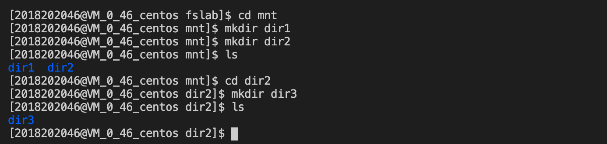
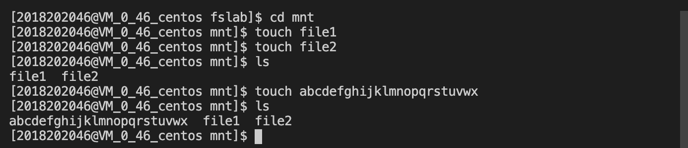
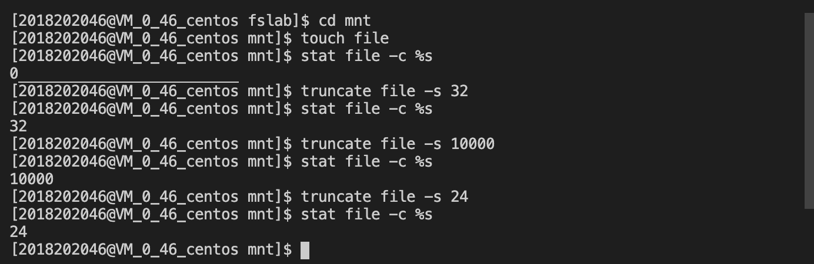
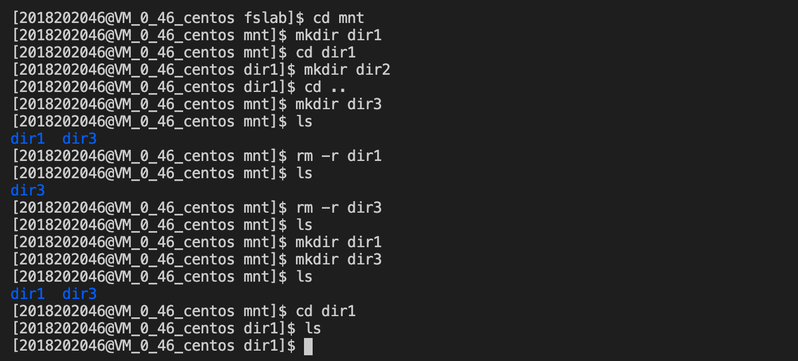
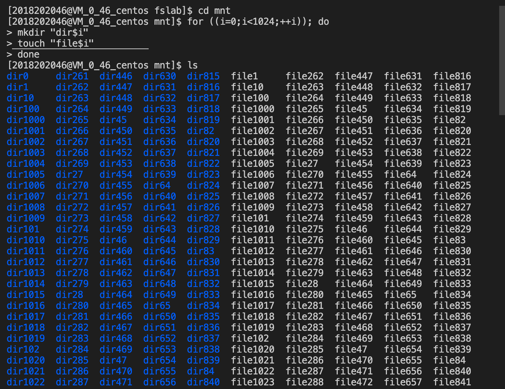
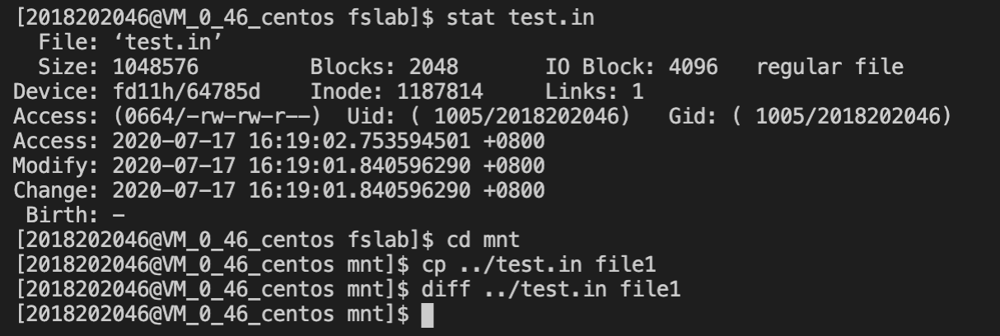

# 计算机系统基础$\text{fslab}$实验报告


班级：<u>信息学院1班</u> 	姓名：<u>方晓坤</u> 	学号：<u>2018202046</u> 	完成日期：<u>2020.7.13</u>


## 一、需求分析

- 在学习文件系统的部分内容后之后，为了深入理解文件系统对系统空间和文件信息的管理——分配、释放、读入、写入、改名等，我们完成了$\text{fslab}$实验。

- 如上文所言，我们需要补充完善至少十三个基础函数：

    - `mkfs`

        文件系统的初始化函数，写入文件系统基本信息及根目录“/”信息

    - `fs_getattr`

        查询目录或常规文件的信息

    - `fs_readdir`

        查询一个目录文件下的所有文件

    - `fs_mknod`

        创建一个常规文件

    - `fs_mkdir`

        创建一个目录文件

    - `fs_rmdir`

        删除一个目录文件

    - `fs_unlink`

        删除一个常规文件

    - `fs_rename`

        更改一个目录文件或常规文件的名称和路径

    - `fs_read`

        对一个常规文件进行读操作

    - `fs_write`

        对一个常规文件进行写操作

    - `fs_truncate`

        修改一个常规文件的大小信息

    - `fs_utime`

        修改一个目录文件或常规文件的时间信息

    - `fs_statfs`

        查询一个文件系统整体的统计信息


## 二、详细设计


### 块的组织和结构

该文件系统总体上采用$\text{VFS}$的形式，即$\text{SuperBlock+InodeBitmap+DataBlockBitmap+InodeBlock+DataBlock}$的形式


#### 信息存储结构

首先是$\text{SuperBlock}$，它的具体结构在指导文件中已经给出：

```c
struct statvfs {
   unsigned long  f_bsize; //块大小
   fsblkcnt_t     f_blocks;//块数量
   fsblkcnt_t     f_bfree; //空闲块数量
   fsblkcnt_t     f_bavail;//可用块数量
   fsfilcnt_t     f_files; //文件节点数
   fsfilcnt_t     f_ffree; //空闲节点数
   fsfilcnt_t     f_favail;//可用节点数
   unsigned long  f_namemax;//文件名长度上限
};

```

我们可以使用一个$\text{Block}$来储存这个结构体


然后来看$\text{InodeBitmap}$和$\text{DataBlockBitmap}$

由于要求本文件系统至少可以支持$\text{32768}$个文件，所以$\text{InodeBitmap}$大小至少为$\cfrac{2^{15}}{8}=2^{12}\text{bit}=4\text{kb}$，即恰好一个$\text{Block}$

又因为该文件系统可以使用的所有空间为$\text{256Mb}$，所以$\text{DataBlockBitmap}$大小至少为$\cfrac{2^8*2^{20}}{2^2*2^{10}}=2^{16}\text{bit}=8\text{kb}$，即恰好两个$\text{Block}$


最后来看$\text{InodeBlock}$

我们同样可以在指导文件中获取$\text{Inode}$的基本结构，再加上一点我自己的小调整——主要为了简化间接指针寻块，就形成了下面的结构：

```c
typedef struct{
    mode_t			mode;
    nlink_t     nlink;
    off_t       size;
    time_t			atime;
    time_t			mtime;
    time_t			ctime;
    size_t			inode_num;
    int         direct_pointer[DP_NUM];
    int         indirect_pointer[IP_NUM];
}my_stat;
```

值得一提的是，我们这里使用了$\text{16}$个直接指针和$\text{2}$个间接指针。每个$\text{inode}$所对应文件最大为$16*4\text{kb}+\cfrac{4\text{kb}}{4\text{byte}}*4\text{kb}=64\text{kb}+8\text{Mb}$，达到了“每个文件大小不超过$\text{8Mb}$”的要求

通过`sizeof(my_stat)`可以知道，一个$\text{inode}$大小是$\text{128byte}$。所以为了支持$\text{32768}$个$\text{inode}$，我们一共需要$\cfrac{2^{15}*128\text{byte}}{4\text{kb}}=1024$个$\text{Block}$


所以综上，该文件系统的前$\text{1028}$个$\text{Block}$的信息存储类别如下：

|          1          |          2           |            3             |            4             |          5          |  ……  |        1028         |
| :-----------------: | :------------------: | :----------------------: | :----------------------: | :-----------------: | :--: | :-----------------: |
| $\text{SuperBlock}$ | $\text{InodeBitmap}$ | $\text{DataBlockBitmap}$ | $\text{DataBlockBitmap}$ | $\text{InodeBlock}$ |      | $\text{InodeBlock}$ |

而后面的$2^{16}-1028$个$\text{Block}$均为$\text{DataBlock}$，下面我们来谈谈$\text{DataBlock}$的存储结构


#### 数据存储结构

一个$\text{4kb}$大小的$\text{Block}$有三种可能的组织结构：

- 常规文件

    这点比较常规，即$\text{4096byte}$的字符型

- 目录文件

    我们新建了一个结构体，用来约束目录文件下的常规文件或目录信息储存格式：

    ```c
    typedef struct
    {
        char		filename[MAX_FILENAME];//文件/目录名
        int     filetype;//文件类型——（常规/目录）
        int     inode_num;//该文件/目录对应的inode编号
    }file_info;
    ```

    我们可以计算得到这个结构体的大小为$\text{24+4+4}=32\text{byte}$，且每个$\text{Block}$可以容纳$\cfrac{4096\text{byte}}{32\text{byte}}=128$个文件信息。

    回到$\text{inode}$的组织方式。虽然我使用了$\text{16+2}$的方式，但是为了逻辑的简便，我有如下规定：目录文件不使用后两个间接指针。虽然这会减少一个目录文件所能容纳的最大文件数，但$\text{16}$个直接指针已经可以支持$\text{16*128=2048}$个常规文件或目录文件的存在，我认为这已经绰绰有余了。
    
- 指针

    间接指针所指向的$\text{Block}$，内部存储最多$\cfrac{4096\text{byte}}{4\text{byte}}=1024$个直接指针

为了能同时使用这三种组织结构，我们使用$\text{union}$来整合：

```c
typedef union
{
    char			file_data[BKSIZE];//常规文件数据块
    file_info	info[FN_IN_DIR];//目录文件数据块
    int				ptr[DP_NUM_PER_IP];//指针文件数据块
}disk_block;
```


### 相关函数的实现

#### 宏定义

为了增强代码的可读性和易修改性，我们定义了一组宏：

```c
#define S_IFDIR 0040000
#define S_IFREG 0100000
#define DIRMODE (S_IFDIR|0755)
#define REGMODE (S_IFREG|0644)

#define DISK "vdisk/"

#define MAX_FILENAME 25    // 文件名最大字节数
#define MAX_PPATHNAME 512    // 父目录路径最大字节数

#define BYTESIZE 8    // 1byte = 8bits
#define BKSIZE 4096    // 1block = 4096bytes
#define FILE_INFO_SIZE 32    // 每个文件夹下 一个文件/文件夹信息所占大小
#define FN_IN_DIR 128    // 一个block能装下的文件/文件夹信息份数 4096 / 32 = 128 

#define SUPER_BLOCK_NUM 0    // superblock 所在block编号
#define IBM_BLOCK_NUM 1     // inode bitmap 所在block编号
#define DBM_BLOCK_NUMA 2    // 第一个 datablock bitmap 所在block编号
#define DBM_BLOCK_NUMB 3    // 第二个 datablock bitmap 所在block编号

#define ROOT_INODE_NUM 0    // 第一个inode编号
#define MAX_INODE_NUM 32768    // 最大的inode编号

#define BID(inode_num) (inode_num / 32 + 4)    // 通过inode_num计算出inode所在的block编号
#define BOFST(inode_num) (inode_num % 32)    // 计算该inode_num在这个block中是第多少个

#define DP_NUM 16    // 16个直接指针
#define IP_NUM 2    // 2个间接指针
#define DP_NUM_PER_IP  1024 // 每个间接指针指向1024个直接指针

typedef int inode_t;
typedef int datablock_t;
```

上面的宏会出现在所有函数的实现中


#### 辅助函数

除了最初需求分析中我们提到的必须补充的十三个关键函数外，我们还需要补充一定的辅助函数。因为在虚拟文件系统工作过程中，有大量相似、甚至重复的操作在不断进行，比如占用一个$\text{Block}$或者取消对它的占用。所以为了提高代码重用率，方便后期调试，我们还补充了一些辅助函数


首先是对信息存储结构，也即$\text{InodeBitmap}$和$\text{DataBlockBitmap}$的操作：

```c
int find_free_inode_num();    // 找到一个空的inode编号(0 ~ 2^15-1)
void set_inode_bitmap(int inode_num);  // 把对应inode_num的inode bitmap 位置设为1
void free_inode_bitmap(int inode_num);    // 把对应inode_num的inode bit map 位置设为0

int find_free_block_num();    // 找到一个空的datablock编号(0 ~ 2^16-1)
void set_block_bitmap(int data_num);   // 把空的datablock bit map 位置设为1
void free_block_bitmap(int data_num); // 把非空的datablock bitmap 位置设为0
```

这六个函数结构和实现基本相似，都是使用了位操作取出符合要求的$\text{bit}$，我们以`find_free_inode_num`为例：

```c
int find_free_inode_num()    // 找到一个空的inode编号(0 ~ 2^15-1)
{
    char buff[BKSIZE];
    disk_read(IBM_BLOCK_NUM, buff);

    for (int byte_pos = 0; byte_pos < BKSIZE; byte_pos++) // 遍历所有的bytes
        for (int bit_pos = 0; bit_pos < BYTESIZE; bit_pos++) // 遍历byte所有的bit
            if (!(buff[byte_pos] & (0x1 << bit_pos))) // 如果该bit==0
                return byte_pos * BYTESIZE + bit_pos;

    return -1;
}
```

其余五个函数实现类似，不再赘述


下面是关于输入的路径解析和处理函数

```c
inode_t match_path(const char*path)    // 通过path找到所在的inode编号
int collect_dir_filename(const char *path, char *parent_path, char *file_name)  // 将 路径 分割成 目录路径+文件名
```

第一个函数非常重要，它的功能是通过解析路径，得到路径对应的常规文件或目录文件对应的$\text{inode}$编号(若不成功则返回$\text{-1}$)

它的实现思路就是先解析出路径中下一级文件的名称，从根目录`"/"`开始，首先通过已知的$\text{inode}$访问文件空间，并拿到该目录下的所有常规文件或目录文件的信息

然后逐一比对文件名，如果到达路径末尾且文件名重合，则返回该文件的$\text{inode}$，结束循环

如果没有到达路径末尾且文件名重合，则保留该文件的$\text{inode}$，然后重复上面的步骤

如果没有文件名重合，则返回错误$\text{-1}$

这个函数的实现细节较多，包括对多级路径的解析、多个$\text{Block}$存储目录下文件信息等，难度很大。下面是一部分核心代码：

```c
for (int i = 0; i < block_num; i++)	// 遍历所有整块
{
  	disk_block dir_search;
    disk_read(inode_data[inode_blockoffset].direct_pointer[i], &dir_search);
  	for (int j = 0; j < FN_IN_DIR; j++)	// 遍历每块128个文件
    		if (strcmp(dir_search.dir.files[j].filename, dir_name) == 0)	// 文件名吻合
      			return dir_search.dir.files[j].inode_num;
}
if (block_left != 0)
{
  	disk_block dir_search;
  	disk_read(inode_data[inode_blockoffset].direct_pointer[block_num], &dir_search);
  	for (int j = 0; j < block_left; j++)	// 遍历不满一整个块的文件
    		if (strcmp(dir_search.dir.files[j].filename, dir_name) == 0) // 文件名吻合
      			return dir_search.dir.files[j].inode_num;
}
return -1;
```


关于第二个函数就比较简单了，它只需要从结尾向前遍历，找到第一个`"/"`符号即可将目录文件的路径和文件名分隔开。这个函数结合上面的`match_path`，可以帮助我们方便的对文件夹进行操作。下面是部分核心代码：

```c
    while (*path_pointer != '/')
    {
        temp_filename[index++] = *path_pointer;
        path_pointer--;
    }

    strcpy(file_name, strrev(temp_filename));
    strncpy(parent_path, path, pathlen - index);
    parent_path[pathlen - index] = '\0';
```


辅助函数到这里就结束了，下面是要着重实现的关键函数了


#### 关键函数


##### `mkfs`

关于`mkfs`承担的工作主要有$\text{3}$个：

- 初始化$\text{SuperBlock}$
- 初始化$\text{DataBlockBitmap}$
- 初始化$\text{InodeBitmap}$，并将根目录的$\text{inode}$写入$\text{InodeBlock}$

至于这些写入的信息细节，前面我都有提到，这里仅展示部分的初始化代码：

```c
    char buff[BKSIZE];
    memset(buff, 0, sizeof(buff));

    buff[0] |= 0x1;
    disk_write(IBM_BLOCK_NUM, buff);    //占用第一个InodeBitmap位

    memset(buff, 0, sizeof(buff));
    for (int i = 0; i < 128; i++)
        buff[i] = 0xFF;
    buff[128] = 0xF;    //前1024+4个bit设为1 标记占用
    disk_write(DBM_BLOCK_NUMA, buff);   //初始化第一个DataBlockBitmap

    memset(buff, 0, sizeof(buff));
    disk_write(DBM_BLOCK_NUMB, buff);   //初始化第二个～
```


##### `fs_getattr`

这个函数要可以根据文件路径查询一个常规文件或目录文件的信息，可以用来检验我们上面实现的辅助函数`match_path`的正确性

主要的实现思路就是：

- 通过`match_path`获取路径对应文件的$\text{inode}$编号
- 通过$\text{inode}$`编号确定`inode`所在的`Block`块编号和在`Block`内`inode`的偏移量`offset`
- 通过数组下标直接定位到这个$\text{inode}$，拿到文件信息

这里就需要用到我上面定义的一组宏了

```c
#define BID(inode_num) (inode_num / 32 + 4)    // 通过inode_num计算出inode所在的block编号
#define BOFST(inode_num) (inode_num % 32)    // 计算该inode_num在这个block中是第多少个
```

在后面函数的实现中，这组宏会被广泛使用。下面是`fs_getattr`的部分实现细节：

```c
    inode_t inode_num = match_path(path);	//解析出inode编号
    if (inode_num == -1)
        return -ENOENT;

    my_stat buff[32];
    memset(buff, 0, sizeof(buff));
    disk_read(BID(inode_num), buff);	//拿到对应的InodeBlock
    int offset = BOFST(inode_num);		//拿到正确的数组下标

    attr->st_mode = buff[offset].mode;	//	记录信息
    attr->st_nlink = buff[offset].nlink;
    attr->st_size = buff[offset].size;
    attr->st_atime = buff[offset].atime;
    attr->st_mtime = buff[offset].mtime;
```


##### `fs_readdir`

这个函数非常重要，它用于查询一个目录文件下的所有文件名信息

实现思路与上面相似：

- 通过`match_path`获得文件夹对应的$\text{inode}$编号
- 通过`inode.size`计算出文件夹下的文件数量，占用的$\text{Block}$数量，剩余的$\text{file}$数量
- 将目录文件的$\text{Block}$内的文件名逐一取出，通过`filler`填入`buffer`

这个实现也有一点细节需要注意，一个$\text{Block}$只能装载$\text{128}$个文件信息，即可能有不满一个$\text{Block}$的情况出现，需要单独处理

下面是核心的实现：

```c
for (int i = 0; i < block_count; i++)	//处理整个block内的文件
{
    disk_block block_data;
    disk_read(dir_data[BOFST(inode_num)].direct_pointer[i], &block_data);
    for (int j = 0; j < FN_IN_DIR; j++)
        filler(buffer, block_data.dir.files[j].filename, NULL, 0);
}
if (file_left != 0)	//	有不满整个block的情况
{
    disk_block block_data;
    disk_read(dir_data[BOFST(inode_num)].direct_pointer[block_count], &block_data);
    for (int j = 0; j < file_left; j++)	//处理剩余的文件
        filler(buffer, block_data.dir.files[j].filename, NULL, 0);
}
```


##### `fs_mkdir`和`fs_mknod`

由于这两个函数的功能相近——一个用于创建目录文件，一个用于创建常规文件，所以放到一起来介绍

相似的功能就定了它们相近的实现思路：

- 先找到一个$\text{inode}$空位，占用它的$\text{InodeBitmap}$
- 初始化这个$\text{inode}$，写入$\text{InodeBlock}$
- 解析路径，得到要创建文件的目录路径和文件名
- 解析目录路径得到父目录文件的$\text{inode}$，将要创建的文件信息写入父目录的$\text{DataBlcok}$

上面最后一步的写入操作比较复杂，需要根据$\text{DataBlock}$的占用情况判读是否需要分配一个新的$\text{Block}$

下面是实现的核心：

```c
long dp_num = file_num / FN_IN_DIR;
long dp_left = file_num % FN_IN_DIR;

if (dp_left != 0)	//不需要新的datablock
{
    disk_block dirfile[1];
    disk_read(parent_inode_info[BOFST(parent_inode_num)].direct_pointer[dp_num], dirfile);

    memcpy(dirfile[0].dir.files[dp_left].filename, filename, 24);	//在末尾修改
    dirfile[0].dir.files[dp_left].filetype = DIRMODE;
    dirfile[0].dir.files[dp_left].inode_num = inode_num;
    parent_inode_info[BOFST(parent_inode_num)].size += 32;//父目录文件大小增加

    disk_write(parent_inode_info[BOFST(parent_inode_num)].direct_pointer[dp_num], dirfile);	//写回
    disk_write(BID(parent_inode_num), parent_inode_info);
}
else//需要新的datablock
{
    datablock_t new_block = find_free_block_num();	//找一个空闲的block
    set_block_bitmap(new_block);
    parent_inode_info[BOFST(parent_inode_num)].direct_pointer[dp_num] = new_block;	//修改父目录指针和大小
    parent_inode_info[BOFST(parent_inode_num)].size += 32;
    
    disk_block dirfile[1];
    memcpy(dirfile[0].dir.files[0].filename, filename, 24);	//首位添加
    dirfile[0].dir.files[0].filetype = DIRMODE;
    dirfile[0].dir.files[0].inode_num = inode_num;

    disk_write(new_block, dirfile);//写回
    disk_write(BID(parent_inode_num), parent_inode_info);
}
```

至于`fs_mknod`的核心实现类似，不再赘述


##### `fs_rmdir`和`fs_unlink`

这两个函数不仅功能相似——一个用于删除目录文件，一个用于删除常规文件，还与上面创建文件的两个操作的逻辑类似

它们大致的实现思路如下：

- 解析路径，得到目录路径和文件名
- 修改父目录$\text{inode}$信息和父目录文件的$\text{DataBlcok}$
- 释放文件的$\text{inode}$和$\text{DataBlock}$

下面以`fs_unlink`为例，介绍它的部分核心代码：

```c
//释放 datablock
if (inode_datablock_count <= DP_NUM)	//	释放前16个block
{
    for (int i = 0; i < inode_datablock_count; i++)
    {
        free_block_bitmap(inode_stat[now_inode_offset].direct_pointer[i]);
    }
}
else if (inode_datablock_count <= (DP_NUM + DP_NUM_PER_IP))	// 释放16+1
{
    for (int i = 0; i < DP_NUM; i++)
    {
        free_block_bitmap(inode_stat[now_inode_offset].direct_pointer[i]);
    }
    disk_block indirect_pointer_data[1];
    disk_read(inode_stat[now_inode_offset].indirect_pointer[0], indirect_pointer_data);
    for (int j = 0; j < (inode_datablock_count - DP_NUM); j++)
    {
        free_block_bitmap(indirect_pointer_data[0].pointer_nextblock[j]);
        free_block_bitmap(inode_stat[now_inode_offset].indirect_pointer[0]);
    }
}
else	//释放 16+2
{
    for (int i = 0; i < DP_NUM; i++)
    {
        free_block_bitmap(inode_stat[now_inode_offset].direct_pointer[i]);
    }

    disk_block indirect_pointer_data[1];
    disk_read(inode_stat[now_inode_offset].indirect_pointer[0], indirect_pointer_data);
    for (int j = 0; j < DP_NUM_PER_IP; j++)
    {
        free_block_bitmap(indirect_pointer_data[0].pointer_nextblock[j]);
        free_block_bitmap(inode_stat[now_inode_offset].indirect_pointer[0]);
    }

    disk_read(inode_stat[now_inode_offset].indirect_pointer[1], indirect_pointer_data);
    for (int j = 0; j < (inode_datablock_count - DP_NUM - DP_NUM_PER_IP); j++)
    {
        free_block_bitmap(indirect_pointer_data[1].pointer_nextblock[j]);
        free_block_bitmap(inode_stat[now_inode_offset].indirect_pointer[1]);
    }
}
```

以及对父目录下$\text{DataBlock}$信息的修改，这部分有一定的技巧性。

如果要删除的文件信息在最后一个，就不需要管。因为我们是通过`inode.size`来访问文件内容的，而前面已经`parent_stat[parent_blockoffset].size -= 32`，所以现在已经访问不到

如果要删除的文件信息不在最后一个，就将最后一个的文案信息拷贝复制到它的位置，实现“删除”操作

除此之外，如果删除后有一个$\text{Block}$空出来，我们需要将它释放

下面是所有的核心细节：

```c
for (int i = 0; i < datablock_num; i++)
{
    disk_block dir_data[1];
    disk_read(parent_stat[parent_blockoffset].direct_pointer[i], dir_data);
    for (int j = 0; j < FN_IN_DIR; j++)
    {
        if (dir_data[0].dir.files[j].inode_num == inode_num)
        {// 根据inode_num匹配出要删除的文件
            if (inode_num != last_file_inode)
            {// 如果不是最后一个文件，就把最后一个文件信息拷贝过去 //如果是最后一个实际上不需要处理，因为根据size已经访问不到
                memcpy(&(dir_data[0].dir.files[j]), &last_files, 32);
                disk_write(parent_stat[parent_blockoffset].direct_pointer[i], dir_data);
                return 0;
            }
        }
    }
}

if (datablock_left == 0)    //删除的文件信息是该block1最后的一个，需要释放整个block
{
    printf("free empty datablock\n");
    free_block_bitmap(parent_stat[parent_blockoffset].direct_pointer[datablock_num]);
    return 0;
}

disk_block dir_data2[1];
disk_read(parent_stat[parent_blockoffset].direct_pointer[datablock_num], dir_data2);
for (int j = 0; j < (datablock_left + 1); j++)
{
    if (dir_data2[0].dir.files[j].inode_num == inode_num)
    {// 根据inode_num匹配出要删除的文件
        if (inode_num != last_file_inode)
        {// 如果不是最后一个文件，就把最后一个文件信息拷贝过去
            memcpy(&(dir_data2[0].dir.files[j]), &last_files, 32);
            disk_write(parent_stat[parent_blockoffset].direct_pointer[datablock_num], dir_data2);
            return 0;
        }
    }
}
```


##### `fs_rename`

这个函数的功能是对一个目录文件或常规文件更名或移动，实现起来也比较复杂，但是可以借鉴上面函数实现的经验

实现它的大致思路是：

- 先分类是只更改文件名还是要移动文件路径，这可以通过解析输入的两个路径来判断
- 如果是只更改文件名不移动文件
    - 解析路径获得父目录路径
    - 解析父目录路径获得父目录$\text{inode}$
    - 通过父目录$\text{inode}$访问父目录$\text{DataBlcok}$
    - 通过逐一比对文件名找到要改名的文件信息，修改文件名并写回
- 如果要移动文件路径
    - 根据上面一样方法获取这个文件的信息
    - 解析新的父目录文件路径获得其$\text{inode}$
    - 通过父目录$\text{inode}$访问父目录$\text{DataBlcok}$，添加这个文件信息
    - 解析原父目录文件路径获得其$\text{inode}$
    - 通过父目录$\text{inode}$访问父目录$\text{DataBlcok}$，删除这个文件信息

这个函数实现复杂，细节繁多，值得庆幸的是前面我们已经完成了它的大部分逻辑，可以直接借用，并且这里不需要申请和释放文件对应的$\text{DataBlock}$。但在父目录下添加和删除文件信息的时候，仍然需要判断是否需要释放或者申请新的$\text{Block}$

核心代码，这里仅以只更改文件名不移动文件为例：

```c
for (int i = 0; i < block_num; i++)	//遍历所有整个块
{
    disk_block blockdata[1];
    disk_read(inode_stat[offset].direct_pointer[i], blockdata);
    for (int j = 0; j < FN_IN_DIR; j++)
    {
        if (strcmp(blockdata[0].dir.files[j].filename, old_filename) == 0)	//找到要改名的文件
        {
            memset(blockdata[0].dir.files[j].filename, 0, 24);
            strcpy(blockdata[0].dir.files[j].filename, new_filename);	//更名
            disk_write(inode_stat[offset].direct_pointer[i], blockdata);//写回
            return 0;
        }
    }
}
if (block_left != 0)	//有剩余文件
{
    disk_block blockdata2[1];
    disk_read(inode_stat[offset].direct_pointer[block_num], blockdata2);
    for (int j = 0; j < block_left; j++) //遍历剩余文件
    {
        if (strcmp(blockdata2[0].dir.files[j].filename, old_filename) == 0)	//找到要改名的文件
        {
            memset(blockdata2[0].dir.files[j].filename, 0, 24);
            strcpy(blockdata2[0].dir.files[j].filename, new_filename); //更名
            disk_write(inode_stat[offset].direct_pointer[block_num], blockdata2);//写回
            return 0;
        }
    }
}
```


##### `fs_utime`和`fs_statfs`

把它俩放一起，因为这俩函数功能简单，方便实现

`fs_utime`只需要解析出$\text{inode}$编号，取到对应$\text{inode}$，记录$\text{inode}$信息，直接写回即可

`fs_ststfs`需要取出$\text{InodeBitmap+DataBlockBitmap}$，统计其中的占用情况和空闲情况，再写回$\text{superBlock}$即可

下面是一些核心实现：

```c
    disk_read(BID(inode_num), inode_info);	

    inode_info[BOFST(inode_num)].ctime = time(NULL);	//修改和记录
    inode_info[BOFST(inode_num)].atime = buffer->actime;
    inode_info[BOFST(inode_num)].mtime = buffer->modtime;	//这里用于touch file -t

    disk_write(BID(inode_num), inode_info);	//写回
```

```c
    for (int byte_pos = 0; byte_pos < BKSIZE; byte_pos++)	//计数
    {
        for (int bit_pos = 0; bit_pos < BYTESIZE; bit_pos++)
        {
            if (!(bfree_data1[byte_pos] & (0x1 << bit_pos)))
                bfree_num++;
            if (!(bfree_data2[byte_pos] & (0x1 << bit_pos)))
                bfree_num++;
            if (!(file_data[byte_pos] & (0x1 << bit_pos)))
                bfiles++;
        }
    }

    stat->f_bfree = bfree_num;	//记录
    stat->f_bavail = bfree_num;
    stat->f_bsize = BKSIZE;
    stat->f_blocks = BLOCK_NUM;    //6W+ in disk.h
    stat->f_files = 32768;
    stat->f_namemax = 24;
    stat->f_files = MAX_INODE_NUM - bfiles;
    stat->f_ffree = bfiles;
    stat->f_favail = bfiles;
```


##### `fs_read`

这是有关读文件的一个重要函数，需要我们从指定的`offset`开始读文件，读入`size`大小，并返回读入的文件大小

如果只是单纯地从文件开头开始读入，逻辑将简单不少。但是要求从指定的`offset`开始，这意味着可能一开始就要访问间接指针。所以为了读数据的鲁棒性，我们将一个读操作分成三部分处理：

- 读起始端——不大于`BKSIZE`
- 读中间段——等于`BKSIZE`
- 读末尾端——不大于`BKSIZE`

同时我们需要判断是否存在中间段和末尾端，即如果起始端和末尾端重合，那我们就只需要从一个$\text{Block}$中读出大小为`size`的长度即可

关于读数据还涉及到一个问题——间接指针的访问。我们需要先通过间接指针访问到存放直接指针的$\text{Block}$，然后计算出的偏移量作为数组下标拿到直接指针，最后通过直接指针访问要读的$\text{Block}$

下面只给出读中间块的核心实现：

```c
for (int i = begin_block_num+1; i < end_block_num; i++)	//遍历所有的中间块
{
    if (i < DP_NUM) 	//直接访问
    {
        char data[BKSIZE] = {0};
        disk_read(inode_info[blockoffset].direct_pointer[i], data);
        memcpy(Buff, data, BKSIZE);
    }
    else if ((i - DP_NUM) < DP_NUM_PER_IP)//由第一个间接指针访问
    {
        char data[BKSIZE] = {0};
        disk_block pointer_data[1];
        disk_read(inode_info[blockoffset].indirect_pointer[0], pointer_data);
        disk_read(pointer_data[0].pointer_nextblock[(i - DP_NUM)], data);
        memcpy(Buff, data, BKSIZE);
    }
    else if ((i - DP_NUM) < 2 * DP_NUM_PER_IP)//由第二个间接指针访问
    {
        char data[BKSIZE] = {0};
        disk_block pointer_data[1];
        disk_read(inode_info[blockoffset].indirect_pointer[1], pointer_data);
        disk_read(pointer_data[0].pointer_nextblock[(i - DP_NUM -DP_NUM_PER_IP)], data);
        memcpy(Buff, data, BKSIZE);
    }
    Buff += BKSIZE;
}
```


##### `fs_write`

这是一个关于写文件的重要函数，在研究完后发现，每次调用这个函数总是文件系统需要对一整个$\text{Block}$进行写操作。这点可以通过`cp`一个大文件进行验证，在比较`fs_write`的调用次数和文件大小后我得出了这个结论。这就意味着在`fs_write`中，可以每次只处理一个$\text{Block}$的写操作

主要的实现思路：

- 和前面一样先拿到$\text{inode}$
- 每次写入都要找一个闲置块，占用$\text{DataBlockBitmap}$

这里还需要注意，如果写入文件比较大，第一次或者第二次使用间接指针时，也要额外为它分配一个$\text{Block}$

下面是一点核心代码：

```c
int data_left_num = nowsize % BKSIZE;

if (now_block_num < DP_NUM)	//	直接访问
{
    char buff[BKSIZE];
    disk_read(inode_info[blockoffset].direct_pointer[now_block_num], buff);	//写入原先文件的一部分
    memcpy(buff + data_left_num, buffer, size);
    disk_write(inode_info[blockoffset].direct_pointer[now_block_num], buff);	//再写入本次追加的部分
    disk_write(BID(inode_num), inode_info);
    return size;
}
else if (now_block_num < DP_NUM + DP_NUM_PER_IP)	// 间接访问
{
    char buff[BKSIZE];
    int now_indirect_block_num = now_block_num - DP_NUM;
    disk_block indirect_pointer_data[1];
    disk_read(inode_info[blockoffset].indirect_pointer[0], indirect_pointer_data);
    disk_read(indirect_pointer_data[0].pointer_nextblock[now_indirect_block_num], buff);
    memcpy(buff + data_left_num, buffer, size);
    disk_write(indirect_pointer_data[0].pointer_nextblock[now_indirect_block_num], buff);
    disk_write(BID(inode_num), inode_info);
    return size;
}
else if (now_block_num < DP_NUM + 2*DP_NUM_PER_IP)	// 间接访问
{
    char buff[BKSIZE];
    int now_indirect_block_num = now_block_num - DP_NUM - DP_NUM_PER_IP;
    disk_block indirect_pointer_data[1];
    disk_read(inode_info[blockoffset].indirect_pointer[1], indirect_pointer_data);
    disk_read(indirect_pointer_data[0].pointer_nextblock[now_indirect_block_num], buff);
    memcpy(buff + data_left_num, buffer, size);
    disk_write(indirect_pointer_data[1].pointer_nextblock[now_indirect_block_num], buff);
    disk_write(BID(inode_num), inode_info);
    return size;
}
```

有点神奇的事，`fs_write`每次传入的参数`size`总是为了和原文件末尾刚好凑成一整个$\text{Block}$，这极大地简化了代码的逻辑


##### `fs_truncate`

这个函数要求我们可以修改文件的大小，这与前面的删除和新建文件的逻辑类似，不再赘述：

- 如果修改大小后$\text{Block}$数量不变，只需要修改`size`即可
- $\text{Block}$数量变小，则释放$\text{Block}$
- $\text{Block}$数量变大，则分配$\text{Block}$


## 三、样例测试

测试了主角提供的部分样例，结果如下：













测试的时候唯一一个过不去的样例是长文件名。由于我的设计，最长文件名不超过$23$个字符(再加上一个`'\0'`一共24个字符)，然而样例给了一个$24$字符的测试点。。。希望助教高抬贵手，不要在意。。。

关于大文件：



这个点耗费时间最长，因为发现`diff`操作需要`fs_read`，而`fs_read`出了一点小问题(关于最后一个快的位置)，在$\text{Vscode}$中可以对比发现少读了一个$\text{block}$。修改完成后就没有问题了