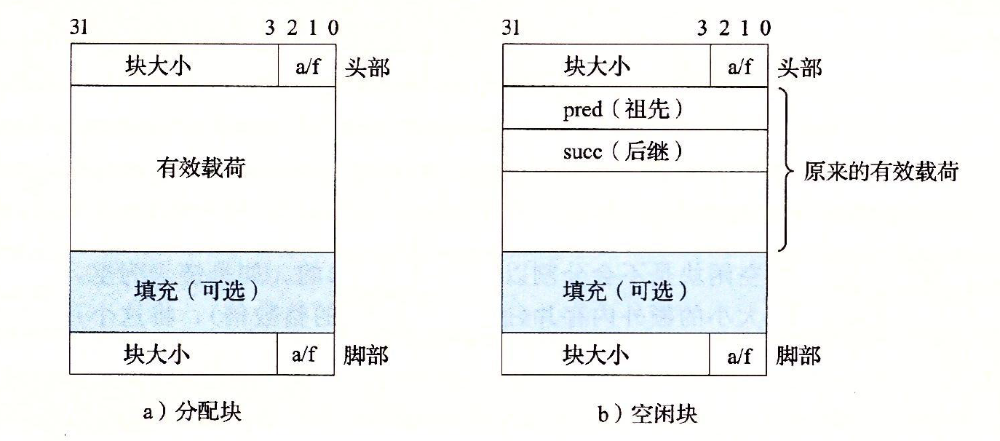
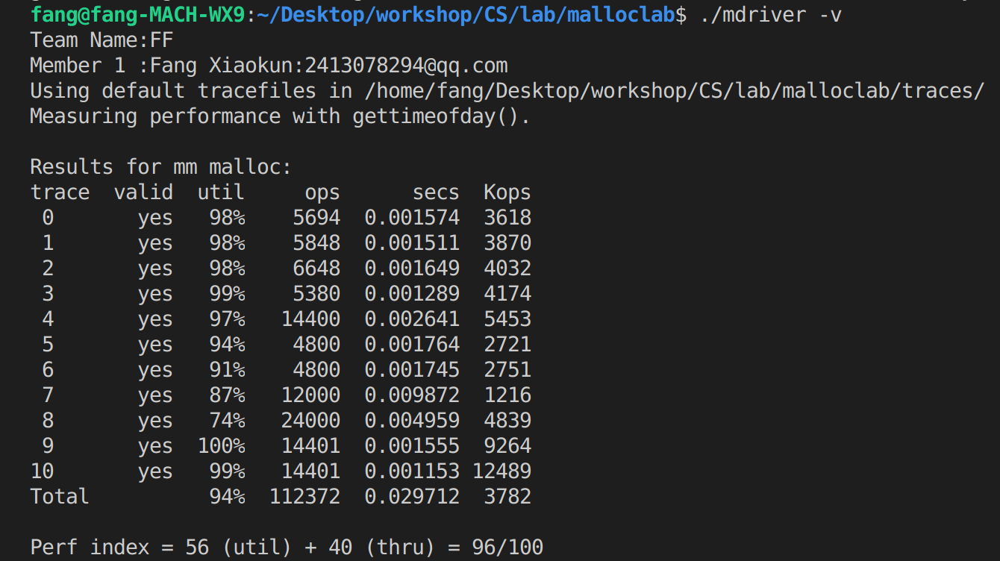

# 计算机系统基础$malloclab$实验报告


###### 班级：<u>信息学院1班</u> 	姓名：<u>方晓坤</u> 	学号：<u>2018202046</u> 	完成日期：<u>2020.3.1</u>


## 一、需求分析

- 在学习$OSTEP$第一大章虚拟化关于$Free-Space\ Management$的部分内容后之后，为了深入理解操作系统底层对堆空间的管理，我们完成了$Malloclab$实验。

- 在本实验中，我们需要重写堆空间的分配、释放和再分配接口函数，除此之外还有分配空间前的初始化函数。

## 二、题目概要和详细解答

### 1、题目概要

如上文所言，我们需要重写四个基础函数：

- `int mm_init (void);`

  必要的初始化，由于被禁止使用任何形式的全局变量和静态变量而显得尤为重要。

- `void *mm_malloc (size_t size);`

  分配堆空间的统一接口。

- `void *mm_free (void *ptr);`

  释放堆空间的统一接口。

- `void *mm_realloc(void *ptr,  size_t size);`

  再分配一块更大的空间，需要有一定的优化来节省空间开支来提高利用率。


### 2、详细解答

#### 尝试和准备

- 详细阅读$CSAPP$$\ 9.9.12$的有关分配器设计的内容

- 补全`void *find_fit(size_t asize)`和`void place(void *bp, size_t asize)`，实现了简单的`first_fit`，但是效果不佳（空间利用率挺高，吞吐量太低，一共得分58）

- 尝试用`best_fit`对实验进行调优，想到之前在群中讨论的“分离式空闲链表的首次适配空间利用率接近最优适配”，再加上本次实验禁止使用全局变量和静态变量，两者难度相似，于是改用`SFL——segregatedFreeList`

- 承袭$CSAPP$中的宏定义，且为了方便双向链表的运算有所增加

  ```c
  /* single word (4) or double word (8) alignment */
  #define ALIGNMENT 8
  
  /* rounds up to the nearest multiple of ALIGNMENT */
  #define ALIGN(size) (((size) + (ALIGNMENT-1)) & ~0x7)
  
  
  #define SIZE_T_SIZE (ALIGN(sizeof(size_t)))
  
  #define WSIZE        4
  #define DSIZE        8
  #define CHUNKSIZE   (1<<9)
  #define BIG_PAYLOAD  80
  
  #define MAX(x, y)   ((x) > (y)? (x) : (y))
  
  #define PACK(size, alloc)   ((size) | (alloc))
  
  #define GET(p)      (*(unsigned int *)(p))
  #define PUT(p, val) (*(unsigned int *)(p) = (val))
  
  #define GET_SIZE(p)     (GET(p) & ~0x7)
  #define GET_ALLOC(p)    (GET(p) & 0x1)
  
  #define HDRP(bp)    ((char *)(bp) - WSIZE)
  #define FTRP(bp)    ((char *)(bp) + GET_SIZE(HDRP(bp)) - DSIZE)
  
  #define NEXT_BLKP(bp)   ((char *)(bp) + GET_SIZE(((char *)(bp) - WSIZE)))
  #define PREV_BLKP(bp)   ((char *)(bp) - GET_SIZE(((char *)(bp) - DSIZE)))
  
  //计算出给定块的前驱和后继指针所存储的位置
  #define PRED_P(fbp)     ((char *)(fbp))
  #define SUCC_P(fbp)     ((char *)(fbp + WSIZE))
  
  //计算出给定块的前驱和后继块的位置
  #define PRED_BLKP(fbp)  (*(char **)(fbp))
  #define SUCC_BLKP(fbp)  (*(char **)(fbp + WSIZE))
  ```

  值得注意的是，这里的所有指针`p`均指向空闲块或占用块的第二个四字节的开头，而非寻常意义下的`header`。且通过以下的图解，我们能清晰理解以上宏的作用。
  
  
  
  

#### 具体实现

我们先从`mm_init`来看，它是一切的开始。

考虑到为了对每个`SFL`进行访问，我必须将它们的指针存放在一段空间内，不会被覆盖且易于访问。然而，不允许使用全局变量和静态变量，这为本次实验带来了不必要的困难。在请教了助教和同学之后，我认识到给定的最大`20M`堆空间，在满足了最基本的空间分配后，是可以自由使用的。这意味着，我可以自行定义一段基本信息放在开头，以便检索和更改。这里我放在堆开头的是`16`个空闲链表的指针。这些链表内的空闲块大小，按照`2`的幂次分类，即`[1],[2-3],[4-7],[8-15],[16-31],[32-63],…,[32768-infinite]`。这里纯属为了方便，前三个链表不会有空闲块插入。具体代码如下。

```c
int mm_init(void)
{
    void *heap_listp = mem_sbrk(16 * WSIZE);
    for(int i = 0; i < 16; i++)
        PUT(sfl(i), NULL);

    heap_listp = mem_sbrk(4*WSIZE);
    PUT(heap_listp, 0);
    PUT(heap_listp + (1*WSIZE), PACK(DSIZE, 1));
    PUT(heap_listp + (2*WSIZE), PACK(DSIZE, 1));
    PUT(heap_listp + (3*WSIZE), PACK(0, 1));

    if(extend_heap(CHUNKSIZE) == NULL)
        return -1;
    return 0;
}
```

这里出现的`sfl`函数，即是根据下标，对链表指针存储的位置进行查询，具体实现如下。

~~~c
void *sfl(int index)
{
    if(0 <= index || index <= 15) return (mem_heap_lo() + index * WSIZE);
    return NULL;
}
~~~

这里还出现的`extend_heap`函数，用于申请更大的堆空间，具体实现如下。

~~~c
void *extend_heap(size_t size)
{
    char *fbp;
    size_t asize = ALIGN(size);
    if((long)(fbp = mem_sbrk(asize)) == -1)
        return NULL;

    PUT(HDRP(fbp), PACK(size, 0));
    PUT(FTRP(fbp), PACK(size, 0));
    PUT(HDRP(NEXT_BLKP(fbp)), PACK(0, 1));
    insert_node(fbp, asize);

    return coalesce(fbp);
}
~~~

课本上原来的`extend_heap`函数，参数是扩展的字数，容易引起迷惑。为了调试时的直观，我将参数单位改成`byte`。在扩展堆空间后，自然会出现一块新的未分配的空间，这就需要我们将其根据大小，插入双向链表中了，这里的功能由`insert_node`函数实现。

~~~c
void insert_node(void *fbp, size_t size)
{
    int index = 0;
    void *target = NULL, *pred_target = NULL;
    while((index < 15) && (size > 1)){
        index++;
        size >>= 1;
    }
    target = (void *)*(char **)sfl(index);
    while((target != NULL) && (size > GET_SIZE(HDRP(target)))){
        pred_target = target;
        target = SUCC_BLKP(target);
    }

    if(target && pred_target){
        PUT(PRED_P(fbp), pred_target);
        PUT(SUCC_P(pred_target), fbp);
        PUT(SUCC_P(fbp), target);
        PUT(PRED_P(target), fbp);
    }
    else if(target && !pred_target){
        PUT(SUCC_P(fbp), target);
        PUT(PRED_P(target), fbp);
        PUT(PRED_P(fbp), NULL);
        PUT(sfl(index), fbp);
    }
    else if(!target && pred_target){
        PUT(PRED_P(fbp), pred_target);
        PUT(SUCC_P(pred_target), fbp);
        PUT(SUCC_P(fbp), NULL);
    }
    else{
        PUT(PRED_P(fbp), NULL);
        PUT(SUCC_P(fbp), NULL);
        PUT(sfl(index), fbp);
    }
}
~~~

关于`insert_node`，首先是根据插入的自由块的大小确定下来块应该被插入哪一个链表中。然后，由于同一个链表中的块的大小是按照从小到大的顺序排列，为了维护这个顺序以提高空间利用率和查找的效率，我们顺序遍历这个链表找到应该被插入的位置。

需要注意的是，在链表中可能的插入位置有四种——前后都有自由块、前没有后有、前有后没有、前后都没有（都没有指该链表为空）。我们需要针对这四种情况，分别制定插入后的指针修改策略。

在将空闲块插入链表后，我们需要检查一遍插入位置在实际栈空间的情况。这也同样分四种情况——前后快都被占用、前占后不占、后占前不占、前后都不占。然后再根据各自的情况，合并前后的自由块，以提高空间利用率，减少内部碎片。

合并多个自由块之后，原先的块首地址较高的自由块会被吸收，函数只会统一返回合并后的大自由块的首地址，并将该自由块根据大小重新插回自由链表中。为了维护分离式自由链表，我们需要一个函数，去删除原先链表中的被吸收的自由块，这就是`delete_node`函数。

```c
void delete_node(void *fbp)
{
    if(fbp == NULL) return;
    int index = 0;
    size_t size = GET_SIZE(HDRP(fbp));
    while ((index < 15) && (size > 1)){
        index++;
        size >>=1;
    }

    void *FBP_SUCC_BLKP = SUCC_BLKP(fbp);
    void *FBP_PRED_BLKP = PRED_BLKP(fbp);

    if(FBP_PRED_BLKP && FBP_SUCC_BLKP){
        PUT(PRED_P(SUCC_BLKP(fbp)), PRED_BLKP(fbp));
        PUT(SUCC_P(PRED_BLKP(fbp)), SUCC_BLKP(fbp));
    }
    else if(!FBP_PRED_BLKP && FBP_SUCC_BLKP){
        PUT(PRED_P(SUCC_BLKP(fbp)), NULL);
        PUT(sfl(index), SUCC_BLKP(fbp));
    }
    else if(FBP_PRED_BLKP && !FBP_SUCC_BLKP){
        PUT(SUCC_P(PRED_BLKP(fbp)), NULL);
    }
    else{
        PUT(sfl(index), NULL);
    }
}
```

删除一个自由块，自然又分四种情况，不再赘述。

到这里，`mm_init`的操作完成了，接下来，就进入了`mm_malloc`的调用阶段。

```c
void *mm_malloc(size_t size)
{
    if(size == 0)
        return NULL;

    size_t asize;
    
    if(size <= DSIZE)
        asize = 2*DSIZE;
    else
        asize = DSIZE + ALIGN(size);
    
    int index = 0;
    size_t target_size = asize;
    void *fbp = NULL;

    while(index < 16){
        if((target_size <= 1) && ((void *)*(char **)sfl(index))){
            fbp = (void *)*(char **)(sfl(index));
            while(fbp && (asize > GET_SIZE(HDRP(fbp)))){
                fbp = SUCC_BLKP(fbp);
            }
            if(fbp) break;
        }
        target_size >>= 1;
        index++;
    }

    if(fbp == NULL){
        if((fbp = extend_heap(MAX(asize, CHUNKSIZE))) == NULL)
            return NULL;
    }
    fbp = place(fbp, asize);
    return fbp;
}
```

像最初提到的那样，我们先做好双字对齐，找到大小范围合适的链表，然后通过首次适配返回合适的空闲块。它的空间利用率接近最优适配，同时还保留着不低的效率。如果没有在链表中找到合适的自由块，它将调用`extend_heap`，拓展堆空间。然后调用`place`函数，去占用链表中指针为`fbp`的自由块。

在我查阅资料的过程中，我发现了一个高明的块占用策略。对于一个自由块远大于所需块大小的情况，我们应做如下考虑：当所需块小于一定程度，应占用自由块的低地址部分；当所需块大于一定程度，应占用自由块的高地址部分。这样一来，在块释放过程中，大的块不会被小的块所割裂，从而提高空间利用率。除此之外，我们还应检查占用后自由块的剩余大小。若其小于`2*DSIZE`，则没有分割的价值，因为`header,footer,pred,succ,payload`加起来已经超过`2*DSIZE`。此举，同样会减少外部碎片。

值得注意的是，$CSAPP$中的`place`函数声明是无返回值的。但是根据以上的占用策略，占用位置的首地址不一定是我们传入的`fbp`。于是，我们需要`place`返回`void *`，即真正的在堆中的占用位置。最初我没有注意到这点，发现`short1-bal.rep`前两个一直`overlap`。

最后，为了维护链表，需要将`fbp`所指向的块删除，将占用所剩余的堆空间打包放入链表。

再来看看`mm_free`，这可能是最好实现的一个函数了。

```c
void mm_free(void *ptr)
{
    size_t size = GET_SIZE(HDRP(ptr));

    PUT(HDRP(ptr), PACK(size, 0));
    PUT(FTRP(ptr), PACK(size, 0));
    insert_node(ptr, size);

    coalesce(ptr);
}
```

它的逻辑简单——将`ptr`所指向的块首位占用位置`0`以形成自由块，将该自由块插入链表，尝试合并链表中的自由块。

最后是`mm_ealloc`，实际上在大作业的线上指导中，王学长就已经提供了一些想法。比如，如果`ptr`相邻的下一个块为自由块，且两者大小之和满足要求，直接合并返回；如果`ptr`指向的是堆中最后一个块，直接将堆空间扩大，返回。我们可以顺着这个逻辑再套一重，如果`ptr`指向的是堆中倒数第二个块，最后一个块没被占用，但加起来大小仍不够……其余情况判断起来效率较低，不如统一采取`naive`方法。代码如下。

```c
void *mm_realloc(void *ptr, size_t size)
{
    if(size == 0)
        return NULL;

    size_t asize;
    
    if(size <= DSIZE)
        asize = 2*DSIZE;
    else
        asize = DSIZE + ALIGN(size);

    void *newptr = ptr;
    size_t available_size = 0, total_size = 0;

    if(GET_SIZE(HDRP(ptr)) >= asize)
        return ptr;
    else if(!GET_SIZE(NEXT_BLKP(HDRP(ptr))) || 
            (!(GET_ALLOC(NEXT_BLKP(HDRP(ptr)))) && !(GET_SIZE(NEXT_BLKP(NEXT_BLKP(HDRP(ptr))))))){
        available_size = GET_SIZE(HDRP(ptr)) + GET_SIZE(HDRP(NEXT_BLKP(ptr)));
        total_size = available_size;
        if(available_size < asize){
            if(extend_heap(MAX(asize - available_size, CHUNKSIZE)) == NULL)
                return NULL;
            total_size = available_size + MAX(asize - available_size, CHUNKSIZE);
        }
        delete_node(NEXT_BLKP(ptr));
        PUT(HDRP(ptr), PACK(total_size, 1));
        PUT(FTRP(ptr), PACK(total_size, 1));
    }
    else if(!(GET_ALLOC(NEXT_BLKP(HDRP(ptr)))) && (total_size = (GET_SIZE(HDRP(ptr)) + GET_SIZE(HDRP(NEXT_BLKP(ptr))))) >= asize){
        delete_node(NEXT_BLKP(ptr));
        PUT(HDRP(ptr), PACK(total_size, 1));
        PUT(FTRP(ptr), PACK(total_size, 1));
    }
    else{
        newptr = mm_malloc(asize);
        memcpy(newptr, ptr, GET_SIZE(HDRP(ptr)));
        mm_free(ptr);
    }
    return newptr;
}
```

到目前为止，测试结果如下：



